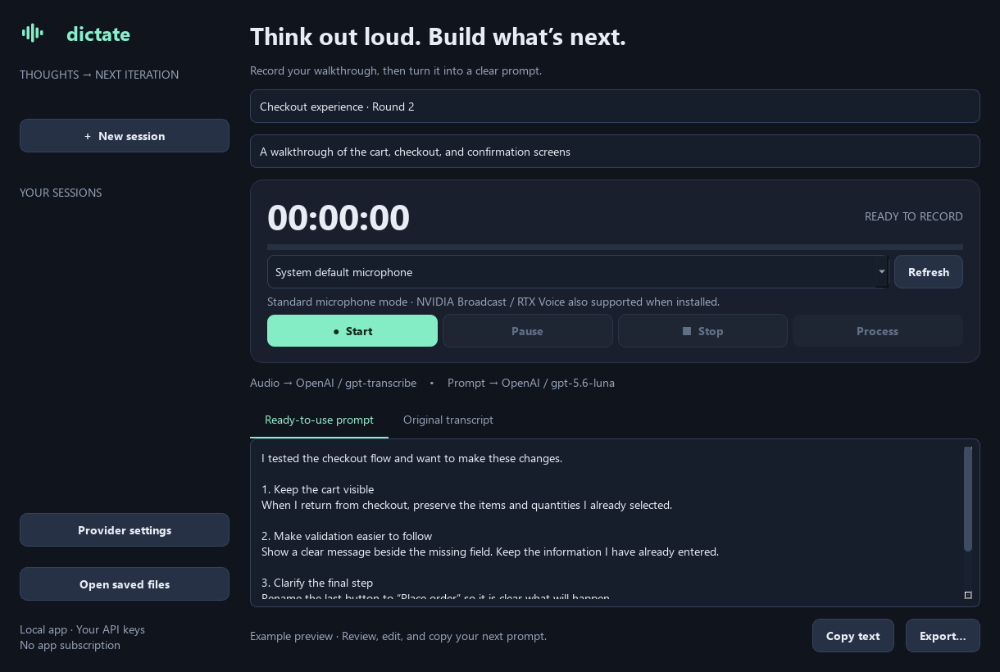

# BrainDump

[](https://github.com/jayty97/braindump/actions/workflows/tests.yml)
[](LICENSE)

**Think out loud. Build what's next.**

A lightweight desktop dictation app that uses AI to convert stream-of-consciousness rambling into clean, formatted text. Record app-testing walkthroughs and turn them into clear, ready-to-paste prompts: start recording, test your app, say what you notice, stop, and process. Bring your own API keys. No app subscription, hosted backend, telemetry, or account to create with this project.

**First public release: 0.1.0 (alpha).** BrainDump is fully open source under the [MIT license](LICENSE). The desktop window, Python package (`dictate-workbench`), and launchers retain the original **Dictate Workbench** name so existing local installations and saved recordings continue to work.



## Features

- Modern dark desktop interface, microphone selection, timer, level meter, pause/resume.
- Continues recording when minimized; closing the window hides it to the system tray where available.
- Audio writes to disk continuously, with bounded memory use for long sessions.
- Separate providers and model IDs for speech-to-text and prompt writing.
- OpenAI Responses API with GPT-5.6 Luna and low/medium reasoning.
- OpenAI GPT-Transcribe, Groq Whisper, and ElevenLabs Scribe transcription adapters.
- Ollama and custom OpenAI-compatible text endpoints, plus compatible speech servers.
- Saved session history, original transcript, editable final prompt, copy and export.
- Completed API steps are cached; retries resume when audio, model, endpoint, and instructions match.
- Optional API-key storage in the operating system credential store; otherwise keys stay in memory.

## Quick start on Windows

Requires **Python 3.11 or newer** with the Python launcher (`py`).

1. [Download the source ZIP](https://github.com/jayty97/braindump/archive/refs/heads/main.zip), extract it to a writable folder, or run `git clone https://github.com/jayty97/braindump.git`.
2. Double-click **setup.cmd** once to install the app's dependencies in `.venv`.
3. Double-click **Start Dictate.cmd**.
4. Open **Provider settings**. Enter your API key and choose your providers. When both stages use the same endpoint, entering a key fills both tabs.
5. Optionally enable **Remember keys**. Otherwise re-enter your key after quitting.
6. Choose the microphone, click **Start**, and speak while testing your app.
7. Click **Stop**, then **Process**. Review the result and copy it into your coding agent.

Closing the window keeps the app in the system tray. Double-click its tray icon to return, or right-click it and select **Quit**. With no system tray, closing requests a normal quit. No recording or upload starts automatically.

### Optional NVIDIA noise removal

Select the NVIDIA Broadcast or RTX Voice virtual microphone in the picker if installed. These inputs are labeled **Noise-filtered**. Otherwise use your normal microphone; Dictate needs no GPU. Configure noise removal in the NVIDIA application first. Broadcast requires an RTX-class GPU; a GTX 1080 may use the older RTX Voice option. See [requirements and fallback behavior](docs/PROVIDERS.md#nvidia-microphone-support).

## macOS and Linux

The Python application uses cross-platform Qt and PortAudio libraries. Use a graphical desktop and Python 3.11+; Python 3.12 is a good starting point. Recent OS versions supported by the installed Qt version are required. The Windows `.cmd` files do not run on macOS/Linux; start the Python module instead.

### macOS

Install Python 3.11+ from [python.org](https://www.python.org/downloads/macos/), then open Terminal:

```sh
git clone https://github.com/jayty97/braindump.git
cd braindump
python3 -m venv .venv
source .venv/bin/activate
python -m pip install --upgrade pip
python -m pip install -e .
python -m dictate
```

Allow microphone access when prompted. If recording is denied, check **System Settings → Privacy & Security → Microphone** for Terminal or the application that launched Python, then restart it. PortAudio is included by the sounddevice pip installation on macOS. Remembered keys use macOS Keychain. No signed `.app` bundle is supplied in this release.

### Linux (Ubuntu / Debian)

Install Python and the native audio/GUI dependencies, then use the same clone, virtual-environment, install, and launch commands shown above:

```sh
sudo apt update
sudo apt install python3 python3-venv git libportaudio2 libegl1 libgl1 libxcb-cursor0 libxkbcommon-x11-0
```

Other distributions use their corresponding PortAudio and Qt runtime packages. Recording requires access to your desktop audio input. Remembered keys need an unlocked Secret Service or KWallet backend; temporary in-memory keys work without saving credentials. Tray behavior depends on the desktop environment. If no tray is available, minimize the window to keep recording; closing quits after handling any active recording.

After the first installation, launch again with:

```sh
cd braindump
source .venv/bin/activate
python -m dictate
```

### Platform status

| Platform | Status | Platform-specific notes |
| --- | --- | --- |
| Windows | Local tests, UI preview, and microphone configuration checked | Double-click launchers; optional NVIDIA virtual microphones |
| Linux | Included in automated tests; manual audio/desktop validation still needed | PortAudio and GUI runtime dependencies; tray varies by desktop |
| macOS | Included in automated tests; manual audio/desktop validation still needed | Microphone permission and Keychain access |

Automated tests use synthetic audio and mocked APIs. A passing CI run verifies code behavior and package building, not a physical microphone or every desktop environment. NVIDIA Broadcast / RTX Voice integration is Windows-only; ordinary recording needs no NVIDIA software on any platform.

References: [Qt supported platforms](https://doc.qt.io/qtforpython-6/overviews/qtdoc-supported-platforms.html) and [sounddevice installation](https://python-sounddevice.readthedocs.io/en/latest/installation.html).

## Providers and current defaults

Documentation checked **September 8, 2026**. Model IDs remain editable because provider availability changes.

| Stage | Provider | Default model | API |
| --- | --- | --- | --- |
| Speech | OpenAI | `gpt-transcribe` | `/v1/audio/transcriptions` |
| Speech | Groq | `whisper-large-v3-turbo` | `/openai/v1/audio/transcriptions` |
| Speech | ElevenLabs | `scribe_v2` | `/v1/speech-to-text` |
| Speech | Custom compatible | User chosen | `/audio/transcriptions` below the base URL |
| Writing | OpenAI | `gpt-5.6-luna` | `/v1/responses`, low reasoning by default |
| Writing | Groq | `llama-3.3-70b-versatile` | `/openai/v1/chat/completions` |
| Writing | Ollama | `llama3.2` | Local `/v1/chat/completions` |
| Writing | Custom compatible | User chosen | `/chat/completions` below the base URL |

OpenAI Settings also offers GPT-6 Astra, GPT-5.6 Terra, and GPT-5.6 Sol. Luna is the selected cost-sensitive default. Low/medium reasoning applies to OpenAI writing requests, not speech processing. Whisper remains manually selectable for legacy compatibility; OpenAI's deprecation notice schedules `whisper-1` retirement for February 26, 2027. The default uses its current recommended replacement.

“Custom compatible” means the server must implement the indicated API contract. It is not a promise that every AI vendor uses the same API. Providers with different authentication or request formats need an adapter. No provider is silently substituted when a request fails.

For Ollama, install and start Ollama separately and pull a model (for example `ollama pull llama3.2`). Enter the exact installed model ID. No API key is needed for localhost. Larger sessions may require increasing the model's context size; see [Ollama's compatibility documentation](https://docs.ollama.com/api/openai-compatibility).

## Cost and privacy

Recording itself is offline. **Process** sends saved audio to your selected speech provider and transcript/context to your writing provider. You pay those services directly under their pricing and account terms. A ChatGPT subscription does not supply API credit.

As checked September 8, 2026, [GPT-Transcribe](https://developers.openai.com/api/docs/models/gpt-transcribe) lists $0.0045/minute (about $0.27 for one hour, plus small chunk overlap). [GPT-5.6 Luna](https://developers.openai.com/api/docs/models/gpt-5.6-luna) lists $0.20/million input tokens and $1.20/million output tokens; reasoning contributes to output usage. These are reference rates, not a billing quote. [Groq's speech documentation](https://console.groq.com/docs/speech-to-text) lists $0.04/hour for Whisper Large V3 Turbo. Check your provider's current account pricing and limits.

No microphone audio is sent while recording. The app does not implement live captions, spoken replies, voice cloning, or an always-listening wake word. Paused time is not recorded. Recordings are not encrypted by the app. Protect the local user account and disk accordingly. OpenAI writing requests set `store: false`; provider retention policies still apply.

Keys are never written to project files or exported transcripts. If **Remember keys** is checked, `keyring` uses the OS credential store. If that store is unavailable, leave Remember unchecked for temporary in-memory keys. To remove a saved key, select its endpoint, clear the key, and save. Custom remote endpoints require HTTPS; HTTP is allowed only for localhost. Confirm the custom endpoint belongs to the provider you intend to trust.

## Saved recordings and recovery

Use **Open saved files** to locate the current session. Defaults:

- Windows: `%LOCALAPPDATA%\DictateWorkbench`
- macOS: `~/Library/Application Support/DictateWorkbench`
- Linux: `${XDG_DATA_HOME:-~/.local/share}/dictate-workbench`

Set `DICTATE_DATA_DIR` to override the data folder. Keep it outside the source tree, particularly before publishing the repository.

Each session stores `audio.pcm` (mono signed 16-bit PCM), its sample rate in `session.json`, `transcript.txt`, `prompt.md`, and reusable processing cache entries. These contain your private session material. Recordings remain until you delete them through your file manager. Quit the app first when deleting session folders.

The recorder tries 16 kHz and falls back to the microphone's default sample rate. One hour is about 115 MB at 16 kHz, or 346 MB at 48 kHz. Processing wraps at most five minutes at a time in WAV with one second of overlap, and keeps each upload below 20 MB. Previously recorded PCM can be recovered after an unexpected shutdown as long as the session metadata survives; the latest unflushed operating-system writes can be lost on power failure.

After a network error, reopen the session and click **Process** again. Completed chunks are reused. A timed-out request may already have been billed, and retrying that request may cost again. Cancel stops after the in-flight request returns; it does not undo a request already sent.

Prompt writing preserves explicit corrections, details, constraints, and unresolved questions in its instructions. This is not a guarantee that a model never omits or mishears a detail. Review the original transcript and final prompt before using them. Longer transcripts for smaller compatible models are organized in sections before final composition; intermediate notes are saved. Errors and truncation are reported instead of treating partial output as complete.

## Development

```sh
python -m pip install -e ".[dev]"
python -m pytest -q
python -m build
```

Tests use synthetic audio and mocked provider responses, with no credentials, paid requests, or microphone capture. To render the real UI with synthetic example text:

```sh
python -m scripts.preview
```

See [CONTRIBUTING.md](CONTRIBUTING.md), [docs/PROVIDERS.md](docs/PROVIDERS.md), [validation notes](docs/VALIDATION.md), and [docs/RELEASING.md](docs/RELEASING.md).

## License and support

BrainDump's original code is released under the [MIT license](LICENSE). You may use, modify, redistribute, and use it commercially under that license. Dependencies retain their own licenses; see [third-party notices](THIRD_PARTY_NOTICES.md). Cloud API services remain subject to their providers' terms and usage charges.

[Report a bug or request a feature](https://github.com/jayty97/braindump/issues). Include your OS and steps to reproduce, but never include API keys or private dictation. For sensitive security reports, follow [SECURITY.md](SECURITY.md).

## Official references

- [OpenAI model catalog](https://developers.openai.com/api/docs/models)
- [OpenAI file transcription](https://developers.openai.com/api/docs/guides/speech-to-text)
- [OpenAI Responses API migration guidance](https://developers.openai.com/api/docs/guides/migrate-to-responses)
- [OpenAI deprecations](https://developers.openai.com/api/docs/deprecations)
- [Groq speech-to-text](https://console.groq.com/docs/speech-to-text) and [compatibility](https://console.groq.com/docs/openai)
- [ElevenLabs Scribe API](https://elevenlabs.io/docs/api-reference/speech-to-text/convert)
- [Ollama OpenAI compatibility](https://docs.ollama.com/api/openai-compatibility)
